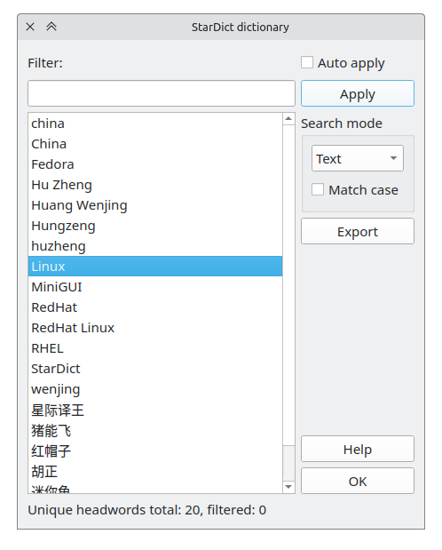

View the unique headwords list for local dictionary.

The headwords dialog can be opened via:

* context menu of dictionaries list
* context menu of icon on dictionaries bar in GoldenDict toolbar
* context menu of dictionaries list in navigation pane

The filter line allow to filter dictionaries list to remain only necessary headwords. Such filtration can be completed in next modes:

| Mode | Filtration type |
|--|--|
| Plain text | Headword contains string from filter line. |
| Wildcards | Headword matched to Unix-like template from filter line. Such template can contain wildcard symbols `?` (matches any one character), `*` (matches any characters number) or ranges of characters `[...]` To find characters `?`, `*`, `[` and `]` it should be escaped by backslash - `\?`, `\*`, `\[`, `\]`. |
| RegExp | Headword matched to regular expression from filter line.|

If option "Auto apply" is turned on any changes in filter line will be applied to headwords list immediately. Otherwise you should press "Apply" button to apply changes. If dictionary contains more than 150000 headwords the "Auto apply" option is disabled.

If option "Match case" is turned on the matches search will be completed in the case-sensitive mode, otherwise in case-insensitive mode.

The "Export" button allow to export the filtered headwords list to text file.

Press "Ctrl+N" shortcut if you want to switch focus to main GoldenDict window. Press "Ctrl+D" to switch focus from main window to headwords dialog.

